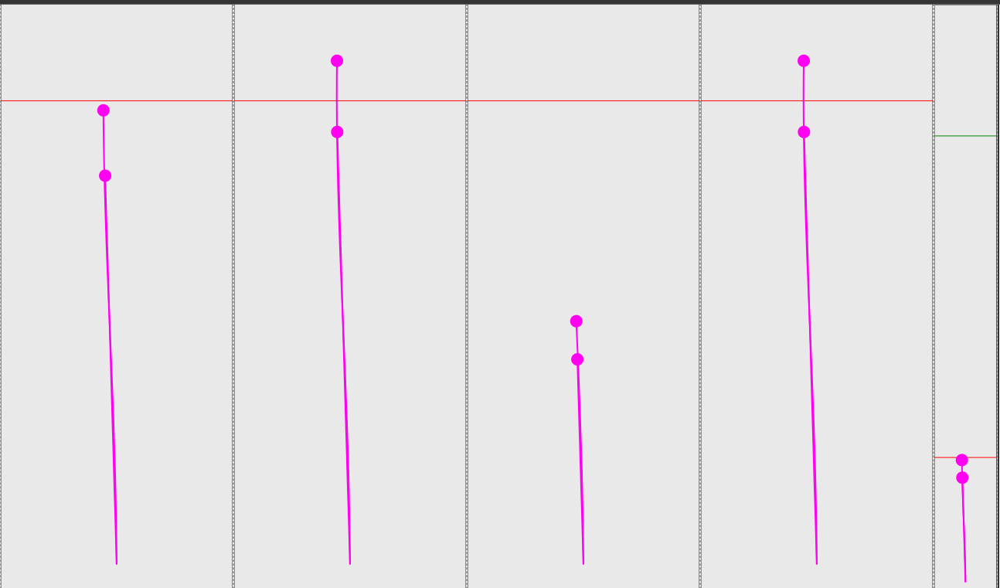

# CurlingRink

## Project setup
```
npm install
npm install d3
npm run serve
```
## 四条赛道和一个预览
```html
      <curling-lane ref="curlingLane0" refName="curlingLane0" :curlingNumer=16 :settingLaneWidthInPixel=300 :cameraEnable="true"></curling-lane>
      <curling-lane ref="curlingLane1" refName="curlingLane1" :curlingNumer=16 :settingLaneWidthInPixel=300 :cameraEnable="true"></curling-lane>
      <curling-lane ref="curlingLane2" refName="curlingLane2" :curlingNumer=16 :settingLaneWidthInPixel=300 :cameraEnable="true"></curling-lane>
      <curling-lane ref="curlingLane3" refName="curlingLane3" :curlingNumer=16 :settingLaneWidthInPixel=300 :cameraEnable="true"></curling-lane>
      <curling-lane ref="curlingLane4" refName="curlingLane4" :curlingNumer=16 :cameraEnable="false"></curling-lane>
```


## CurlingLane 冰壶赛道

1. 轨迹重放 speed为0, 将恢复轨迹最后状态
this.$refs.curlingLane.replay(trajectory, speed)

2. 接收websocket坐标点, 在websocket消息收听函数中调用下面API
this.$refs.curlingLane.playFrame(point, speed)

3. 标签说明
* curlingNumber 小球数量
* settingLaneWidthInPixel 轨道宽度设定, 轨道长度自动等比计算
* settingLaneWidthInPixel 如果不设置, 将会开启预览模式, 届时, 轨道长度等于100vh, 宽度自动等比计算
* cameraEnable 是否使用摄像头,进行小球跟踪和缩放等功能. 

```html
<curling-lane ref="curlingLane0" refName="curlingLane0" :curlingNumer=16 :settingLaneWidthInPixel=300 :cameraEnable="true"></curling-lane>
```